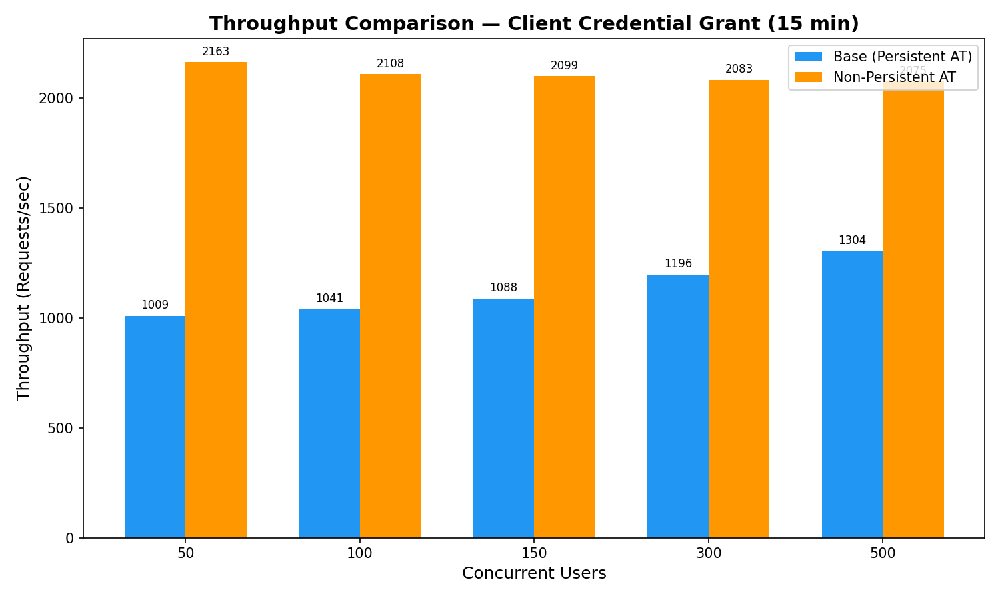
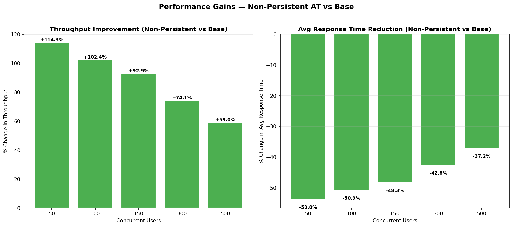
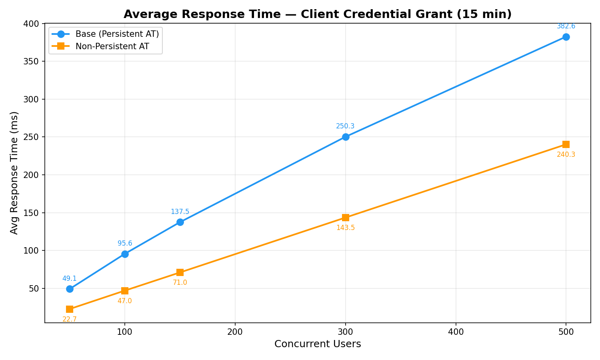
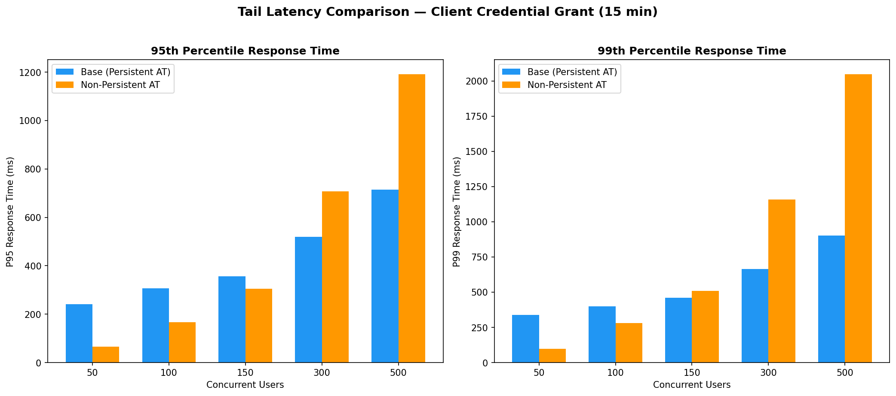
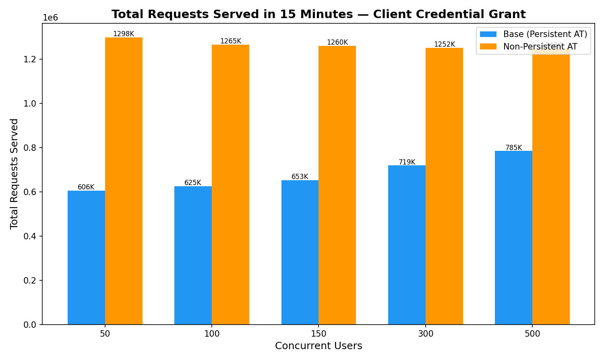
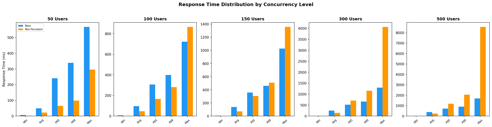

# Performance Analysis: Client Credential Grant (15-minute test)

## Test Configuration
| Parameter | Value |
|-----------|-------|
| **Grant Type** | Client Credentials |
| **Test Duration** | 15 minutes |
| **Heap Size** | 4G |
| **Node** | 2 |
| **Concurrent User Levels** | 50, 100, 150, 300, 500 |
| **Error Rate** | 0% (both configurations) |

## Configurations Compared
| Label | Description |
|-------|-------------|
| **Base (Persistent AT)** | Base pack with persistent access token |
| **Non-Persistent AT** | Non-persistent access token feature enabled |

---

## Executive Summary

The **Non-Persistent Access Token** configuration delivers a **major performance improvement** across all concurrency levels compared to the base persistent access token setup.

### Key Highlights
- **Throughput doubled**: Non-persistent AT achieves ~2x the throughput of the base at every concurrency level
- **Response times halved**: Average response times are ~40-54% lower across all loads
- **2x more requests served**: In the same 15-minute window, non-persistent AT served roughly double the total requests
- **Zero errors**: Both configurations maintained 0% error rate throughout

---

## Detailed Metrics Comparison

### Throughput (Requests/sec)

| Concurrent Users | Base (Persistent AT) | Non-Persistent AT | Improvement |
|:---:|:---:|:---:|:---:|
| 50 | 1009.11 | 2162.98 | **+114.3%** |
| 100 | 1041.27 | 2107.93 | **+102.4%** |
| 150 | 1087.89 | 2098.85 | **+92.9%** |
| 300 | 1196.13 | 2082.55 | **+74.1%** |
| 500 | 1304.48 | 2074.73 | **+59.0%** |

**Analysis:**

- Throughput improvement ranges from **+59.0%** (at 500 users) to **+114.3%** (at 50 users).
- The base configuration scales from 1009 to 1304 TPS (29.3% increase) as users grow from 50 to 500.
- The non-persistent configuration stays remarkably stable: 2163 to 2075 TPS — only a 4.1% drop, indicating **superior scalability under load**.
- At 500 concurrent users, non-persistent AT delivers **1.59x** the throughput of the base.

### Average Response Time (ms)

| Concurrent Users | Base (Persistent AT) | Non-Persistent AT | Improvement |
|:---:|:---:|:---:|:---:|
| 50 | 49.13 | 22.68 | **-53.8%** |
| 100 | 95.62 | 46.99 | **-50.9%** |
| 150 | 137.47 | 71.01 | **-48.3%** |
| 300 | 250.26 | 143.54 | **-42.6%** |
| 500 | 382.64 | 240.30 | **-37.2%** |

**Analysis:**

- Average response time is consistently lower for non-persistent AT across all concurrency levels.
- The improvement ranges from **37.2%** to **53.8%** reduction.
- At 500 users, base averages 382.6ms vs non-persistent at 240.3ms — a **142.3ms** reduction.
- Non-persistent AT's response time growth is more linear — from 22.7ms to 240.3ms — suggesting **predictable latency scaling**.

### Tail Latency (P95 & P99)

| Concurrent Users | Base P95 | NP P95 | Base P99 | NP P99 |
|:---:|:---:|:---:|:---:|:---:|
| 50 | 241 | 65 | 339 | 99 |
| 100 | 307 | 167 | 399 | 281 |
| 150 | 357 | 305 | 461 | 509 |
| 300 | 519 | 707 | 663 | 1159 |
| 500 | 715 | 1191 | 903 | 2047 |

**Analysis:**

- At low concurrency (50 users), non-persistent AT has significantly lower tail latency: P95 = 65ms vs 241ms.
- At high concurrency (500 users), non-persistent AT P95 (1191ms) **exceeds** base P95 (715ms) — a **66.6%** increase.
- Similarly, P99 at 500 users: non-persistent = 2047ms vs base = 903ms — a **126.7%** increase.
- **Critical observation**: While average and median response times are far superior for non-persistent AT, the tail latency (P95/P99) degrades significantly at 300+ concurrent users. 

### Response Time Variability (Standard Deviation)

| Concurrent Users | Base StdDev (ms) | NP StdDev (ms) |
|:---:|:---:|:---:|
| 50 | 70.50 | 20.58 |
| 100 | 98.68 | 58.14 |
| 150 | 115.86 | 106.35 |
| 300 | 151.48 | 252.73 |
| 500 | 187.44 | 447.69 |

**Analysis:**
- Non-persistent AT shows **higher variability** at elevated concurrency levels.
- At 50 users: base StdDev = 70.5ms vs NP = 20.6ms — NP is **more consistent**.
- At 500 users: base StdDev = 187.4ms vs NP = 447.7ms — NP has **2.4x higher variance**.
- The growing variance correlates with the tail latency spikes observed above, indicating that while most requests complete very fast, a small fraction experience significant delays under high load.

### Maximum Response Time

| Concurrent Users | Base Max (ms) | NP Max (ms) |
|:---:|:---:|:---:|
| 50 | 568 | 296 |
| 100 | 722 | 866 |
| 150 | 1028 | 1358 |
| 300 | 1299 | 4069 |
| 500 | 1695 | 8563 |

**Analysis:**
- Maximum response times for non-persistent AT are dramatically higher at elevated loads.
- At 500 users: base max = 1695ms vs NP max = 8563ms — **5.1x higher**.
- This indicates rare but severe latency spikes in the non-persistent configuration, likely from GC pauses under high throughput.

### Total Requests Served (15 minutes)

| Concurrent Users | Base | Non-Persistent AT | Multiplier |
|:---:|:---:|:---:|:---:|
| 50 | 605,766 | 1,298,089 | **2.14x** |
| 100 | 625,059 | 1,265,363 | **2.02x** |
| 150 | 653,247 | 1,260,384 | **1.93x** |
| 300 | 718,998 | 1,251,702 | **1.74x** |
| 500 | 784,742 | 1,248,166 | **1.59x** |

### Response Time Distribution by Concurrency

---

### Strengths of Non-Persistent AT
1. **~2x throughput** across all concurrency levels — the most significant finding
2. **~40-54% lower average response times** — consistently faster for the majority of requests
3. **Stable throughput** that doesn't degrade much as users increase (2163 → 2075 TPS)
5. **Zero errors** maintained throughout — reliability is not compromised
6. **Lower minimum response times** (2ms vs 6-7ms) — faster best-case performance
