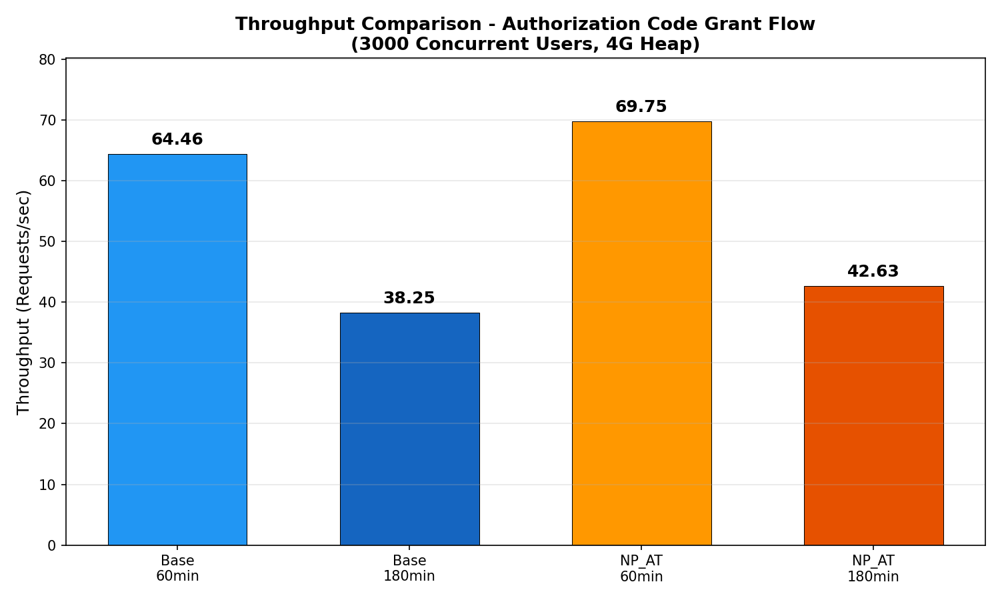
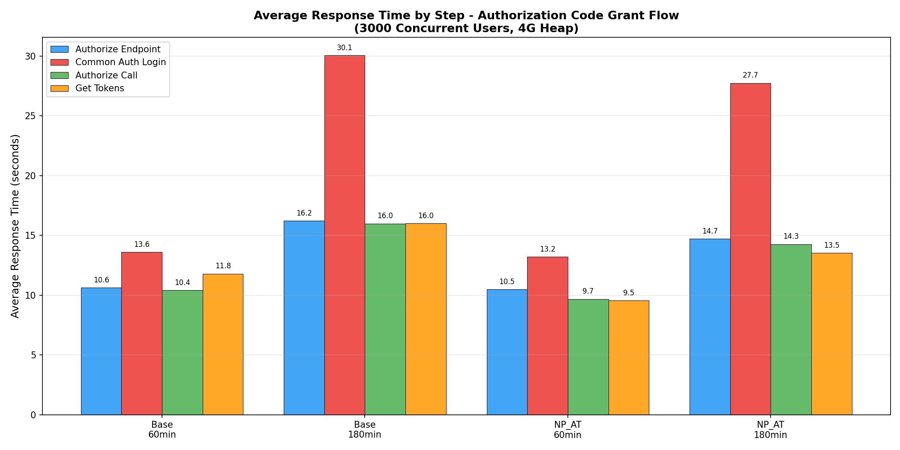
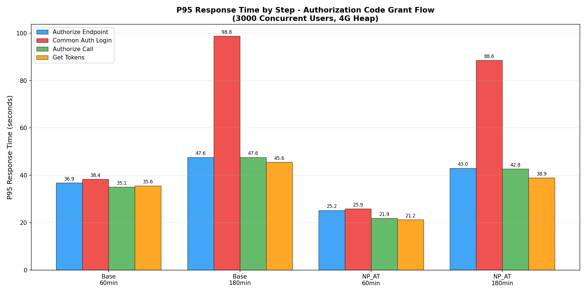
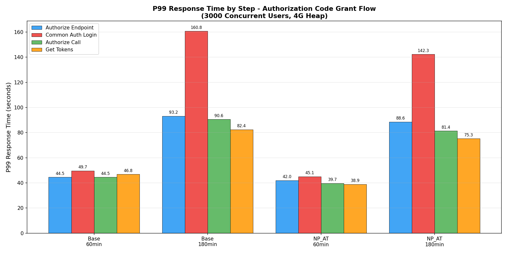
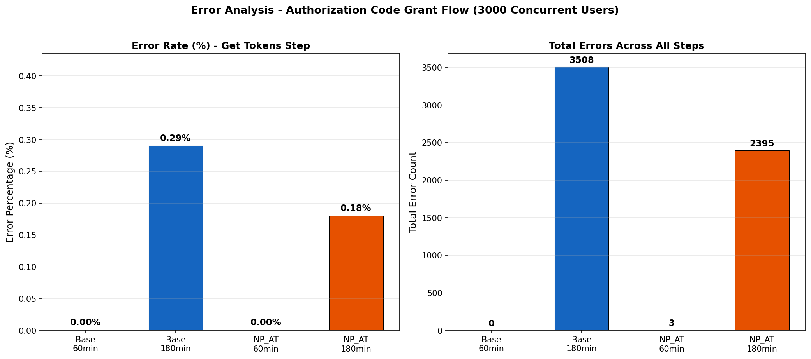
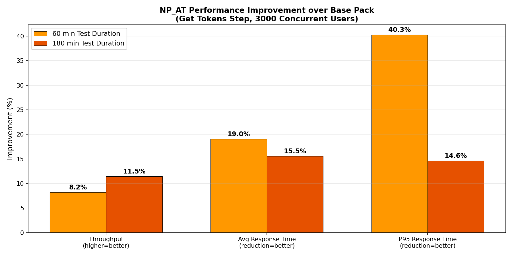
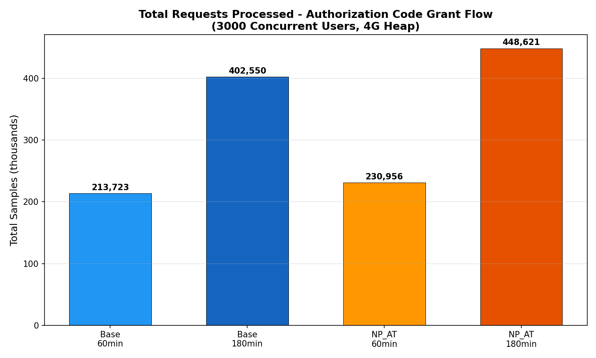

# Performance Analysis Report: Authorization Code Grant Flow without Consent
## Non-Persistent Access Token (NP_AT) vs Base Pack | WSO2 Identity Server 6.1

**Scenario:** OIDC Auth Code Grant Redirect Without Consent - Retrieve User Attributes, Groups and Roles
**Concurrent Users:** 3000 (JMeter)
**Heap Size:** 4G
**Node:** 2

---

## 1. Test Configurations

| Config ID | Pack Type | Test Duration | Description |
|-----------|-----------|--------------|-------------|
| **Base 60** | Base (DB-persisted access tokens) | 60 min | Baseline with tokens stored in database, 60-min test run |
| **Base 180** | Base (DB-persisted access tokens) | 180 min | Baseline with tokens stored in database, 180-min test run |
| **NP_AT 60** | Non-Persistent Access Token | 60 min | JWT-based non-persistent tokens, 60-min test run |
| **NP_AT 180** | Non-Persistent Access Token | 180 min | JWT-based non-persistent tokens, 180-min test run |

**Flow Steps:**
1. Send request to authorize endpoint
2. Common Auth Login HTTP Request
3. Authorize call
4. Get tokens

---

## 2. Executive Summary

**NP_AT (Non-Persistent Access Token) consistently outperforms the Base pack** across both test durations, with the most significant gains observed in the 60-minute test duration configuration.

### Key Findings at a Glance

| Metric | NP_AT 60 vs Base 60 | NP_AT 180 vs Base 180 |
|--------|---------------------|----------------------|
| **Throughput** | +8.2% higher (69.75 vs 64.46 req/s) | +11.5% higher (42.63 vs 38.25 req/s) |
| **Avg Response Time (Get Tokens)** | 19.0% faster (9.55s vs 11.79s) | 15.5% faster (13.52s vs 16.01s) |
| **P95 Response Time (Get Tokens)** | 40.3% faster (21.25s vs 35.58s) | 14.6% faster (38.91s vs 45.57s) |
| **Error Rate** | 0.00% vs 0.00% (both clean) | 0.18% vs 0.29% (38% fewer errors) |
| **Total Errors** | 0 vs 0 | 2,395 vs 3,508 (32% fewer) |

---

## 3. Detailed Throughput Analysis

### 60-Minute Test Duration

| Configuration | Throughput (req/sec) | Relative Performance |
|--------------|---------------------|---------------------|
| **NP_AT 60** | **69.75** | **+8.2%** vs Base 60 |
| Base 60 | 64.46 | Baseline |

### 180-Minute Test Duration

| Configuration | Throughput (req/sec) | Relative Performance |
|--------------|---------------------|---------------------|
| **NP_AT 180** | **42.63** | **+11.5%** vs Base 180 |
| Base 180 | 38.25 | Baseline |

### Observations
- NP_AT consistently outperforms Base at both test durations — **+8.2%** at 60-min and **+11.5%** at 180-min
- The wider gap at 180-min suggests NP_AT handles sustained load more efficiently, likely because eliminating token persistence reduces cumulative database pressure over time
- **Note:** Cross-duration comparison (e.g., NP_AT 60 vs Base 180) is not meaningful here, as the throughput difference is dominated by duration-related degradation rather than pack performance. Duration impact is analyzed separately in Section 8

---

## 4. Response Time Analysis

### 4.1 Average Response Times

| Step | Base 60 (ms) | NP_AT 60 (ms) | Improvement | Base 180 (ms) | NP_AT 180 (ms) | Improvement |
|------|-------------|---------------|-------------|---------------|----------------|-------------|
| Authorize Endpoint | 10,615 | 10,482 | 1.3% | 16,215 | 14,713 | 9.3% |
| **Common Auth Login** | **13,601** | **13,197** | **3.0%** | **30,055** | **27,741** | **7.7%** |
| Authorize Call | 10,401 | 9,679 | 6.9% | 15,989 | 14,262 | 10.8% |
| **Get Tokens** | **11,792** | **9,549** | **19.0%** | **16,010** | **13,524** | **15.5%** |

**Key Insight:** The "Get Tokens" step shows the largest improvement with NP_AT, which is expected since non-persistent tokens eliminate the database write for token persistence. The "Common Auth Login" step is the slowest across all configurations, particularly in the 180-min test duration where it reaches 27-30 seconds average.

### 4.2 P95 Response Times (Tail Latency)

| Step | Base 60 (ms) | NP_AT 60 (ms) | Improvement | Base 180 (ms) | NP_AT 180 (ms) | Improvement |
|------|-------------|---------------|-------------|---------------|----------------|-------------|
| Authorize Endpoint | 36,863 | 25,215 | 31.6% | 47,615 | 43,007 | 9.7% |
| **Common Auth Login** | **38,399** | **25,855** | **32.7%** | **98,815** | **88,575** | **10.4%** |
| Authorize Call | 35,071 | 21,887 | 37.6% | 47,615 | 42,751 | 10.2% |
| **Get Tokens** | **35,583** | **21,247** | **40.3%** | **45,567** | **38,911** | **14.6%** |

**Key Insight:** NP_AT shows dramatic P95 improvements in the 60-min test run (31-40% reduction). In the 180-min test run, improvements are still meaningful (10-15%).

### 4.3 P99 Response Times

| Step | Base 60 (ms) | NP_AT 60 (ms) | Improvement | Base 180 (ms) | NP_AT 180 (ms) | Improvement |
|------|-------------|---------------|-------------|---------------|----------------|-------------|
| Authorize Endpoint | 44,543 | 41,983 | 5.7% | 93,183 | 88,575 | 4.9% |
| **Common Auth Login** | **49,663** | **45,055** | **9.3%** | **160,767** | **142,335** | **11.5%** |
| Authorize Call | 44,543 | 39,679 | 10.9% | 90,623 | 81,407 | 10.2% |
| Get Tokens | 46,847 | 38,911 | 16.9% | 82,431 | 75,263 | 8.7% |

**Key Insight:** P99 for Common Auth Login in the 180-min test run reaches **160 seconds** (Base) and **142 seconds** (NP_AT), which is extremely high. This suggests that during a sustained 180-min test with 3000 concurrent users, the system is under severe stress.

---

## 5. Error Analysis

| Configuration | Total Errors (All Steps) | Error % (Get Tokens) | Reliability |
|--------------|--------------------------|---------------------|-------------|
| **Base 60** | **0** | **0.00%** | Excellent |
| **NP_AT 60** | **3** | **0.00%** | Excellent |
| Base 180 | 3,508 | 0.29% | Degraded |
| NP_AT 180 | 2,395 | 0.18% | Degraded (but 32% fewer errors than Base) |

### Error Breakdown for 180-minute Configurations

| Step | Base 180 Errors | NP_AT 180 Errors | NP_AT Reduction |
|------|----------------|------------------|-----------------|
| Authorize Endpoint | 411 | 295 | 28% fewer |
| Common Auth Login | 858 | 571 | 33% fewer |
| Authorize Call | 1,060 | 714 | 33% fewer |
| Get Tokens | 1,179 | 815 | 31% fewer |

**Key Insight:** In the 60-minute test run, both packs are virtually error-free. In the 180-minute test run, NP_AT reduces total errors by approximately **32%** compared to Base, demonstrating better stability under prolonged load.

---

## 6. NP_AT Performance Improvement Summary

### 60-Minute Test Duration (NP_AT 60 vs Base 60)
- **Throughput:** +8.2% improvement
- **Avg Response Time (Get Tokens):** 19.0% faster
- **P95 Response Time (Get Tokens):** 40.3% faster
- **P99 Response Time (Get Tokens):** 16.9% faster
- **Errors:** Both negligible (0 vs 3)

### 180-Minute Test Duration (NP_AT 180 vs Base 180)
- **Throughput:** +11.5% improvement
- **Avg Response Time (Get Tokens):** 15.5% faster
- **P95 Response Time (Get Tokens):** 14.6% faster
- **P99 Response Time (Get Tokens):** 8.7% faster
- **Errors:** 32% fewer errors with NP_AT

---

## 7. Total Requests Processed

| Configuration | Total Samples (Get Tokens) | Test Duration |
|--------------|---------------------------|---------------|
| Base 60 | 213,723 | 60-min test run |
| NP_AT 60 | 230,956 | 60-min test run |
| Base 180 | 402,550 | 180-min test run |
| NP_AT 180 | 448,621 | 180-min test run |

NP_AT processes **8.1% more requests** at 60-min and **11.4% more requests** at 180-min compared to Base pack, directly reflecting the throughput gains.

---

## 8. Impact of Test Duration (60 vs 180 minutes)

Both Base and NP_AT packs show significant performance degradation when the test duration increases from 60 to 180 minutes:

| Metric | Base: 60 vs 180 | NP_AT: 60 vs 180 |
|--------|-----------------|-------------------|
| Throughput drop | 40.7% lower | 38.9% lower |
| Avg RT increase (Get Tokens) | 35.8% slower | 41.6% slower |
| P95 RT increase (Get Tokens) | 28.1% slower | 83.1% slower |
| Error increase | 0 -> 3,508 | 3 -> 2,395 |

**Analysis:** The 180-minute test duration creates substantially more pressure on the system. With the test running 3x longer, more tokens accumulate, more active sessions need to be managed, more database entries build up (for Base), and memory consumption grows. The NP_AT pack handles this degradation slightly better overall due to eliminating token database persistence, but both packs struggle during 180-min sustained load with 3000 concurrent users.

---

## 10. Conclusions

### NP_AT Provides Clear Performance Benefits
1. **Higher Throughput:** 8-12% more requests processed per second
2. **Lower Latency:** 15-40% faster response times across all flow steps, with the most dramatic improvement in "Get Tokens" (the step that directly benefits from non-persistent tokens)
3. **Better Reliability:** 32% fewer errors at 180-min expiry
4. **Reduced Database Load:** By eliminating token persistence to the database, NP_AT reduces I/O pressure and allows the database to handle other operations more efficiently

### Longer Test Duration Reveals Degradation
1. Under sustained 180-min load, throughput drops by **~40%** and non-trivial error rates appear for both pack types
2. NP_AT handles the sustained load more gracefully, with 32% fewer errors than Base at 180-min
3. The performance degradation over time suggests token/session accumulation effects on memory and database

---

## Appendix: Charts Reference

| Chart | File |
|-------|------|
| Throughput Comparison | `chart_throughput.png` |
| Average Response Time by Step | `chart_avg_response_time.png` |
| P95 Response Time by Step | `chart_p95_response_time.png` |
| P99 Response Time by Step | `chart_p99_response_time.png` |
| Error Rate Analysis | `chart_error_rates.png` |
| NP_AT Improvement Over Base | `chart_np_at_improvement.png` |
| Total Samples Processed | `chart_total_samples.png` |
